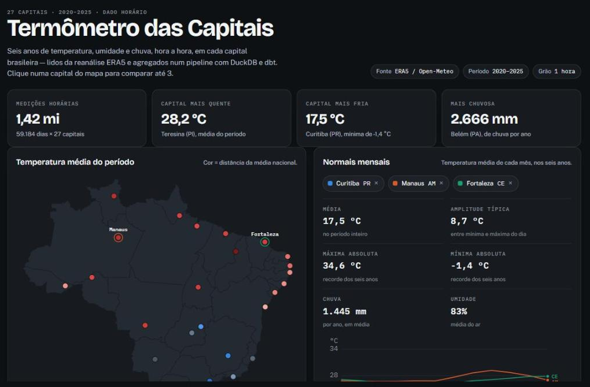
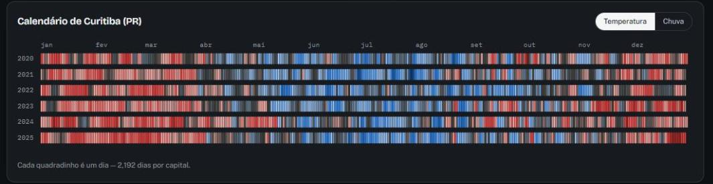

# Termômetro das Capitais

**Dashboard ao vivo: https://jx-dev-c.github.io/clima-capitais-pipeline/**

[](https://jx-dev-c.github.io/clima-capitais-pipeline/)

Pipeline de dados que lê **seis anos de clima hora a hora** nas 27 capitais
brasileiras e entrega um dashboard interativo. Da API pública ao gráfico:
extração particionada, warehouse, modelagem dimensional, 99 testes automatizados
e deploy contínuo.

| | |
|---|---|
| **1.420.416** medições horárias | 27 capitais × 6 anos, 15 MB em Parquet |
| **99 testes** | 14 pytest · 69 dbt · 16 vitest, todos no CI |
| **~2 s** | `dbt build` completo (6 models, 59.184 dias) |
| **77 KB** | do dashboard transferidos, sem biblioteca de gráficos |



## O que o dado mostra

- **Teresina (PI)** é a capital mais quente: 28,2 °C de média no período.
- **Curitiba (PR)** é a mais fria: 17,5 °C, com mínima de −1,4 °C em julho de 2021.
- **Belém (PA)** é a mais chuvosa: 2.666 mm por ano — quase o dobro de Goiânia (941 mm).
- **Salvador (BA)** tem a menor variação entre dia e noite (3,9 °C); **Goiânia (GO)**,
  a maior (11,1 °C). É o contraste entre litoral e planalto, visível no mapa.
- No **perfil horário**, Manaus e Fortaleza andam coladas o dia inteiro, enquanto
  Curitiba varia 8 °C entre o amanhecer e as 15h.

## Como funciona

```
API Open-Meteo (reanálise ERA5)
  -> Extração (Python, 1 requisição por capital/ano, escrita atômica)
  -> Parquet particionado   data/raw/open_meteo/capital=pr/ano=2024/
  -> Load (DuckDB, schema raw, com piso de volume)
  -> dbt (staging -> marts em star schema, 69 testes)
  -> web/public/dados.json
  -> App Angular (SVG próprio) publicado no GitHub Pages
```

| Model | Grão | O que é |
|---|---|---|
| `stg_clima_horario` | capital + hora | tipagem em DECIMAL e recortes de calendário |
| `dim_capital` | capital | nome, UF, região, coordenada, população |
| `fct_clima_diario` | capital + dia | mín, máx, média, amplitude, chuva, umidade |
| `agg_clima_mensal` | capital + mês | normais mensais (só dias completos) |
| `agg_perfil_horario` | capital + hora do dia | temperatura média por hora |
| `agg_capital_resumo` | capital | números do período (alimenta o mapa) |

## Stack

- **Extração**: Python (requests, tenacity, pandas)
- **Raw**: Parquet com compressão zstd, particionado por capital/ano
- **Warehouse**: DuckDB (arquivo local, zero infraestrutura)
- **Transformação**: dbt (dbt-duckdb) — 6 models, 69 testes
- **App**: Angular 22 (standalone, signals, zoneless) com SVG escrito à mão
- **CI/CD**: GitHub Actions — pytest, dbt sobre amostra sintética, testes do
  Angular e deploy no Pages

## Como rodar

```bash
# 1. ambiente (Python 3.11/3.12 — dbt ainda não suporta 3.13+)
python -m venv .venv
source .venv/bin/activate        # Windows: .venv\Scripts\activate
pip install -r requirements.txt

# 2. malha dos estados, para o mapa
python -m scripts.baixar_malha

# 3. extração: 162 requisições, uns 5 minutos
python -m src.extract.open_meteo --anos 2020-2025
# para testar rápido: --capitais pr,am --anos 2024

# 4. carga no DuckDB
python -m src.load.load_to_duckdb

# 5. transformação e testes
cd dbt/clima && dbt deps && dbt build --profiles-dir . && cd ../..

# 6. dados do dashboard e app
python -m dashboard.build_dashboard     # escreve web/public/dados.json
cd web && npm install && npm start      # abre em localhost:4200
```

Sem baixar nada da API: `python -m scripts.gerar_amostra --ano 2024` gera uma
amostra sintética com as 27 capitais e o mesmo schema — é o que o CI usa.

## Decisões e trade-offs

- **Por que dado horário, se a API entrega média diária pronta?** A agregação
  fica no dbt, versionada e testável, em vez de embutida numa chamada HTTP — e é
  o que permite o gráfico "perfil do dia". O custo é volume: 1,4 milhão de
  linhas em vez de 59 mil.

- **Por que particionar por capital/ano em Parquet?** Ano fechado nunca muda. A
  extração pula partição que já existe (`--forcar` refaz), então uma execução
  interrompida retoma de onde parou — e a gravação é atômica (arquivo temporário
  + `os.replace`), senão uma interrupção deixaria um Parquet truncado que seria
  pulado para sempre.

- **Por que congelar as coordenadas num seed CSV?** A API de geocoding responde
  mais de um resultado para o mesmo nome — existe uma "Manaus" no Pará além da
  capital do Amazonas. Resolver nome → coordenada a cada execução deixaria o
  pipeline trocar de cidade sem ninguém perceber. `scripts/gerar_seed_capitais.py`
  roda uma vez, filtra por `feature_code` de capital e confere o estado.

- **Por que conferir a resposta da API?** Ela devolve HTTP 200 mesmo ignorando o
  que não entendeu: fuso inválido vira GMT e a coordenada é encaixada na célula
  de grade mais próxima. Um erro de sinal na longitude traria o clima de outro
  lugar sem nenhum sintoma. A extração compara fuso e coordenada do que voltou
  com o que foi pedido, e recusa ano fechado com menos horas que o calendário.

- **Por que DECIMAL e não DOUBLE nas métricas?** Soma de ponto flutuante depende
  da ordem das linhas, e o DuckDB agrega em paralelo. Com DOUBLE, rodar
  `dbt build` duas vezes sobre o mesmo Parquet mudava o último dígito de alguns
  valores — Goiânia oscilava entre 940,7 e 940,8 mm/ano. Com DECIMAL o
  `dados.json` sai idêntico byte a byte a cada reprocessamento.

- **Por que um estágio de Load, se o DuckDB lê Parquet direto?** Para o dbt ler
  de uma tabela com contrato, não de um glob que pode estar pela metade. O load
  recusa carga com menos capitais que o seed: `CREATE OR REPLACE` é idempotente,
  mas obediente — trocaria a tabela inteira por meia extração sem reclamar.

- **Por que DuckDB e não Postgres ou nuvem?** O dado cabe em 15 MB e o
  `dbt build` completo roda em ~2 segundos. Subir container (ou warehouse na
  nuvem) adicionaria infraestrutura sem responder nenhuma pergunta nova. A
  separação em camadas é a mesma; trocar o adapter do dbt é o que mudaria.

- **Por que gráficos escritos à mão, sem biblioteca?** O bundle inteiro dá 77 KB
  transferidos. O mapa já vem projetado do Python (a malha do IBGE vira `path`
  SVG no build), então sobrava pouco para a biblioteca fazer — e SVG no template
  do Angular usa os mesmos signals do resto do app.

- **Por que carregar o JSON inteiro (610 KB) de uma vez?** É série histórica
  fechada: não muda, e o navegador cacheia. Uma API paginada faria sentido se o
  dado fosse vivo — e exigiria um servidor só para servir o que é arquivo
  estático.

## Qualidade de dados

Os testes existem para pegar erro silencioso — o que não quebra nada, só mostra
número errado. Três deles nasceram de falhas reais encontradas em revisão:

- **Cobertura por ausência** (`assert_cobertura_completa`) — cruza o seed de
  capitais com os anos esperados e cobra cada combinação, inclusive as que não
  existem. A versão anterior agrupava o próprio fato: apagar a partição inteira
  de uma capital passava limpo, porque o grupo simplesmente não existia.
- **Toda capital tem fato** (`assert_toda_capital_tem_fato`) — o teste de
  `relationships` só olha fato → dimensão. Sem este, uma capital sumindo da
  extração deixava o mapa com 26 pontos e o CI verde.
- **Sanidade física** — mínima nunca maior que máxima, média sempre entre as
  duas, e `amplitude = máxima − mínima` conferida. Um teste de faixa não pegaria
  min/max trocados: os dois valores continuam plausíveis.
- **Cardinalidade** — 12 meses e 24 horas por capital. Unicidade garante que não
  há linha repetida, não que não está faltando linha.
- **Faixas calibradas no dado observado** (−5 a 40 °C de média diária), não no
  recorde nacional: limite largo demais deixa passar erro de offset.

O CI roda tudo isso a cada push, sobre uma amostra sintética de 27 capitais e um
ano inteiro — o dado real não é versionado e baixar 162 anos-capital da API a
cada push seria abuso de um serviço gratuito.

## Limitações conhecidas

- **É reanálise, não estação meteorológica.** ERA5 é um modelo em grade de ~9 km
  alimentado por observações. As mínimas e máximas "absolutas" aqui são do ponto
  de grade e por hora cheia — são sistematicamente mais amenas que o recorde de
  uma estação do INMET, e o pico entre duas horas cheias se perde.
- **A população vem do GeoNames** (via geocoding da Open-Meteo), não do IBGE, e
  não é do mesmo período do clima. Está no dashboard como contexto, não como
  fonte demográfica.
- **A série não se atualiza sozinha.** `ANOS` tem default fixo (2020–2025) e não
  há agendamento: o pipeline roda quando alguém manda rodar.

## Roadmap

- [ ] Agendar a carga do ano corrente e declarar `source freshness`
- [ ] Segundo indicador da mesma API (vento, radiação solar), reaproveitando o
      padrão `fetch_*`/`parse_*`
- [ ] Comparar a reanálise com estações do INMET onde houver sobreposição
